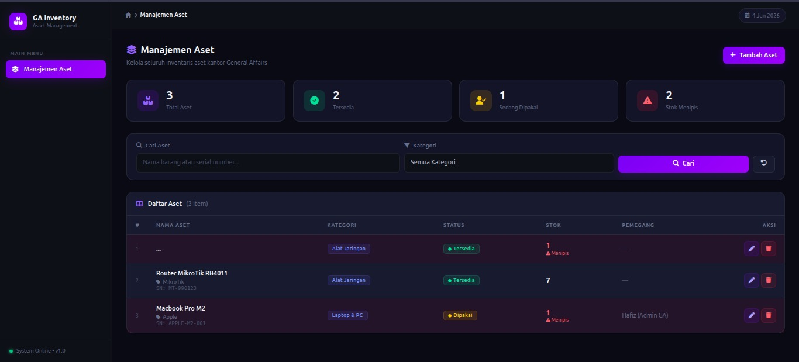
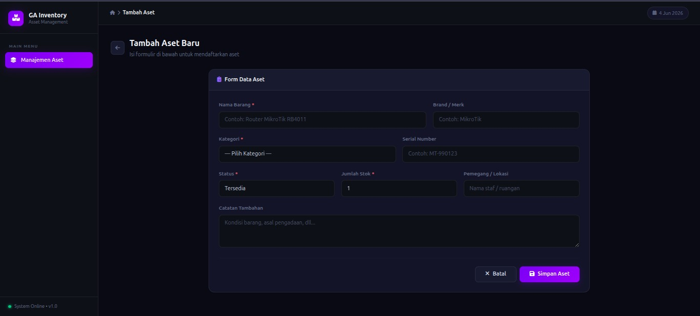
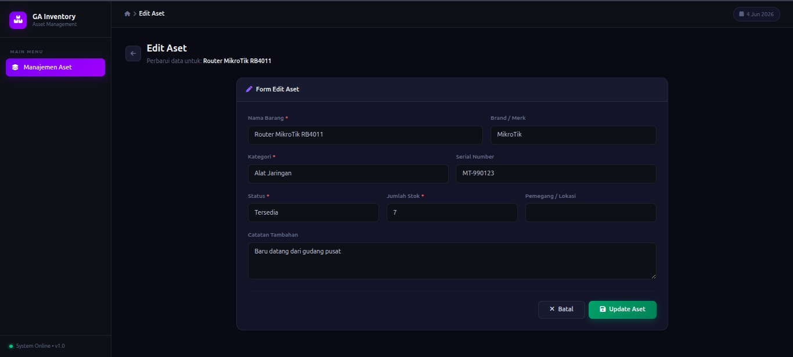

# 📦 GA Inventory — Sistem Manajemen Inventaris Aset

Aplikasi web manajemen inventaris aset berbasis **Laravel 13** untuk kebutuhan General Affairs (GA). Dibangun untuk mempermudah pencatatan, pencarian, dan pengelolaan barang/aset kantor secara efisien.

🌐 **Live Demo:** [https://ga-inventory.rf.gd](https://ga-inventory.rf.gd)

---

## Fitur Utama

- **Manajemen Aset** — Tambah, edit, dan hapus data aset dengan mudah
- **Kategori Aset** — Pengelompokan aset berdasarkan kategori (Alat Jaringan, Laptop & PC, Alat Teknik, dll.)
- **Filter & Pencarian** — Cari aset berdasarkan nama / serial number, dan filter berdasarkan kategori
- **Alert Stok Menipis** — Notifikasi otomatis ketika stok aset ≤ 5 unit
- **Status Aset** — Lacak status barang: `Tersedia`, `Dipakai`, atau `Rusak`
- **REST API** — Endpoint JSON untuk mengakses data aset (`/api/assets`)
- **Konfirmasi Hapus** — Dialog konfirmasi berbasis SweetAlert2 sebelum menghapus data

---

## Screenshots & Interface

### Screenshot 1: Halaman Daftar Aset (Dashboard)



**Deskripsi Detail:**

Halaman utama (dashboard) menampilkan overview lengkap inventaris aset kantor dengan interface yang modern dan responsif. Berikut detail setiap komponen:

#### **Stat Cards (Statistik Cepat)**
- **Total Aset (3)** — Menampilkan jumlah keseluruhan aset yang terdaftar dalam sistem
- **Tersedia (2)** — Aset yang status-nya "Tersedia" dan siap digunakan
- **Sedang Dipakai (1)** — Aset yang sedang digunakan oleh staf tertentu
- **Stok Menipis (2)** — Alert otomatis untuk aset dengan stok ≤ 5 unit (warning indicator)

#### **Filter & Pencarian**
- **Input Search** — Cari aset berdasarkan nama barang atau serial number
- **Dropdown Kategori** — Filter berdasarkan kategori (Alat Jaringan, Laptop & PC, Alat Teknik, dll)
- **Tombol Cari** — Eksekusi pencarian dengan parameter yang sudah dipilih
- **Tombol Reset** — Clear filter dan kembali ke tampilan awal

#### **Tabel Daftar Aset**
Menampilkan data aset dalam format tabel dengan kolom:
- **#** — Nomor urut item
- **NAMA ASET** — Nama barang, brand, dan serial number (terlihat untuk Router MikroTik RB4011, Macbook Pro M2)
- **KATEGORI** — Badge dengan warna berbeda (Alat Jaringan = biru, Laptop & PC = kuning)
- **STATUS** — Indicator visual dengan warna (Tersedia = hijau, Dipakai = kuning, Rusak = merah)
- **STOK** — Jumlah unit barang, dengan warning merah jika stok ≤ 5
- **PEMEGANG** — Nama staf yang memiliki/memegang aset (contoh: Hafiz untuk Macbook)
- **AKSI** — Tombol Edit (pencil icon) dan Delete (trash icon)

#### **Catatan Visual**
- Baris dengan stok ≤ 5 ditandai dengan background merah transparan untuk warning
- Sidebar kiri menampilkan logo "GA Inventory" dan menu navigasi
- Topbar menunjukkan breadcrumb dan tanggal saat ini (4 Jun 2026)

---

### Screenshot 2: Form Tambah/Edit Aset



**Deskripsi Detail:**

Form untuk menambahkan aset baru atau mengedit data aset yang sudah ada. Antarmuka dirancang user-friendly dengan validasi real-time.

#### **Form Data Aset (Struktur)**

**Baris 1: Nama & Brand**
- **Nama Barang*** (required) — Input text untuk nama barang (contoh: Router MikroTik RB4011)
  - Placeholder: "Contoh: Router MikroTik RB4011"
  - Field wajib diisi (ditandai dengan asterisk merah)
- **Brand / Merk** (optional) — Merk manufaktur barang (contoh: MikroTik, Apple)
  - Placeholder: "Contoh: MikroTik"

**Baris 2: Kategori & Serial Number**
- **Kategori*** (required) — Dropdown untuk memilih kategori
  - Options: "Alat Jaringan", "Laptop & PC", "Alat Teknik"
  - Field wajib diisi
- **Serial Number** (optional) — Nomor identifikasi unik barang
  - Placeholder: "Contoh: MT-990123"
  - Unique constraint di database (tidak boleh duplikat)

**Baris 3: Status, Stok & Pemegang**
- **Status*** (required) — Dropdown pilihan status barang
  - Options: "Tersedia", "Dipakai", "Rusak"
  - Field wajib diisi
- **Jumlah Stok*** (required) — Input number untuk kuantitas
  - Default value: 1
  - Min value: 0
  - Field wajib diisi
- **Pemegang / Lokasi** (optional) — Nama staf atau ruangan tempat barang disimpan
  - Placeholder: "Nama staf / ruangan"

**Baris 4: Catatan Tambahan**
- **Catatan Tambahan** (optional) — Text area untuk informasi tambahan
  - Placeholder: "Kondisi barang, asal pengadaan, dll..."
  - Bisa memuat multiple lines teks

#### **Action Buttons**
- **Batal** — Kembali ke halaman daftar aset tanpa menyimpan data
- **Simpan Aset** (Primary Button) — Simpan data form ke database
  - Disertai validasi form side-client
  - Akan redirect ke daftar aset setelah berhasil

#### **Fitur Tambahan**
- **Back Navigation** — Tombol panah di bagian atas untuk kembali
- **Visual Feedback** — Form field dengan border focus yang jelas
- **Responsive Design** — Layoutnya responsive untuk berbagai ukuran layar

---

### Screenshot 3: Form Edit Aset



**Deskripsi Detail:**

Halaman untuk mengedit data aset yang sudah ada. Form ini sama dengan halaman tambah aset, namun:
- Field sudah terisi dengan data aset yang sebelumnya
- Tombol "Update Aset" mengganti "Simpan Aset"
- Memudahkan untuk melihat dan mengubah data existing

#### **Form Data Aset - Edit Mode**

**Header Section:**
- **Breadcrumb** — Menunjukkan: Home > Edit Aset
- **Judul** — "Edit Aset"
- **Sub-judul** — "Perbarui data untuk: Router MikroTik RB4011"
- **Back Button** — Tombol panah untuk kembali ke daftar aset

**Baris 1: Nama & Brand (Pre-filled)**
- **Nama Barang*** — Sudah terisi: "Router MikroTik RB4011"
- **Brand / Merk** — Sudah terisi: "MikroTik"

**Baris 2: Kategori & Serial Number (Pre-filled)**
- **Kategori*** — Sudah dipilih: "Alat Jaringan"
- **Serial Number** — Sudah terisi: "MT-990123"

**Baris 3: Status, Stok & Pemegang (Pre-filled)**
- **Status*** — Sudah dipilih: "Tersedia"
- **Jumlah Stok*** — Sudah terisi: "7" (nilai terbaru)
- **Pemegang / Lokasi** — Kosong (tidak ada pemegang untuk item ini)

**Baris 4: Catatan Tambahan (Pre-filled)**
- **Catatan Tambahan** — Sudah terisi: "Baru datang dari gudang pusat"

#### **Action Buttons (Berbeda dari Create)**
- **Batal** — Kembali ke halaman daftar aset tanpa menyimpan (background gelap)
- **Update Aset** (Primary Button - GREEN) — Update data aset ke database
  - Berbeda dengan "Simpan Aset" di halaman tambah
  - Warna hijau menunjukkan action update/modify
  - Akan redirect ke daftar aset setelah berhasil

#### **Perbedaan dengan Form Create**

| Aspek | Create | Edit |
|-------|--------|------|
| **Judul** | "Tambah Aset Baru" | "Edit Aset" |
| **Isi Field** | Kosong/default | Terisi dengan data lama |
| **Button Text** | "Simpan Aset" | "Update Aset" |
| **Button Color** | Purple/Indigo | Green |
| **HTTP Method** | POST | PUT/PATCH |
| **Route** | /assets/create → POST /assets | /assets/{id}/edit → PUT /assets/{id} |
| **Redirect** | Ke daftar aset (created) | Ke daftar aset (updated) |

#### **User Experience Highlights**

- **Data Preservation** — Semua field sudah terisi dengan nilai sebelumnya
- **Visual Differentiation** — Warna button hijau membedakan dari create
- **Easy Modification** — User bisa dengan mudah ubah field yang ingin diperbarui
- **Confirmation** — SweetAlert2 confirmation sebelum update (optional)
- **Responsive** — Form tetap responsive di berbagai ukuran layar

---

## Teknologi yang Digunakan

| Teknologi | Versi | Keterangan |
|-----------|-------|------------|
| PHP | ^8.3 | Bahasa pemrograman utama |
| Laravel | ^13.7 | Framework backend |
| Laravel Sanctum | ^4.0 | Autentikasi API |
| SQLite | — | Database default |
| Bootstrap | 5.3 | UI framework (via CDN) |
| Font Awesome | 6.4 | Ikon (via CDN) |
| SweetAlert2 | 11 | Dialog konfirmasi (via CDN) |
| Tailwind CSS | ^4.0 | Utility CSS (build tool) |
| Vite | ^8.0 | Asset bundler |

---

## Struktur Folder Lengkap

```
ga-inventory/
│
├── 📁 app/
│   ├── 📁 Http/
│   │   ├── 📁 Controllers/
│   │   │   ├── 📄 AssetController.php         # CRUD aset (web interface)
│   │   │   └── 📁 Api/
│   │   │       └── 📄 AssetApiController.php  # REST API endpoint
│   │   └── 📁 Resources/
│   │       └── 📄 AssetResource.php           # JSON resource transformer
│   ├── 📁 Models/
│   │   ├── 📄 Asset.php                      # Model aset + scope lowStock
│   │   ├── 📄 Category.php                   # Model kategori
│   │   └── 📄 User.php                       # Model user (auth)
│   └── 📁 Providers/
│       └── 📄 AppServiceProvider.php          # Service provider aplikasi
│
├── 📁 bootstrap/
│   ├── 📄 app.php                            # Bootstrap aplikasi
│   ├── 📄 providers.php                      # Provider configuration
│   └── 📁 cache/
│       ├── 📄 packages.php                   # Package manifest
│       └── 📄 services.php                   # Service manifest
│
├── 📁 config/
│   ├── 📄 app.php                            # Konfigurasi aplikasi
│   ├── 📄 auth.php                           # Konfigurasi autentikasi
│   ├── 📄 cache.php                          # Konfigurasi cache
│   ├── 📄 database.php                       # Konfigurasi database
│   ├── 📄 filesystems.php                    # Konfigurasi storage
│   ├── 📄 logging.php                        # Konfigurasi logging
│   ├── 📄 mail.php                           # Konfigurasi email
│   ├── 📄 queue.php                          # Konfigurasi queue
│   ├── 📄 sanctum.php                        # Konfigurasi API auth
│   ├── 📄 services.php                       # Konfigurasi pihak ketiga
│   └── 📄 session.php                        # Konfigurasi session
│
├── 📁 database/
│   ├── 📄 .gitignore                         # Abaikan file sqlite
│   ├── 📁 factories/
│   │   └── 📄 UserFactory.php                # Factory untuk user testing
│   ├── 📁 migrations/
│   │   ├── 📄 0001_01_01_000000_create_users_table.php
│   │   ├── 📄 0001_01_01_000001_create_cache_table.php
│   │   ├── 📄 0001_01_01_000002_create_jobs_table.php
│   │   ├── 📄 2026_05_10_145349_create_categories_table.php
│   │   ├── 📄 2026_05_10_145355_create_assets_table.php
│   │   └── 📄 2026_05_13_142920_create_personal_access_tokens_table.php
│   ├── 📁 seeders/
│   │   ├── 📄 DatabaseSeeder.php             # Main seeder
│   │   ├── 📄 CategorySeeder.php             # Seed kategori awal
│   │   └── 📄 AssetSeeder.php                # Seed aset contoh
│   └── 📄 database.sqlite                    # Database file (local dev)
│
├── 📁 public/
│   ├── 📄 .htaccess                          # Apache routing config
│   ├── 📄 favicon.ico                        # Website favicon
│   ├── 📄 index.php                          # Entry point aplikasi
│   └── 📄 robots.txt                         # SEO robots directive
│
├── 📁 resources/
│   ├── 📁 css/
│   │   └── 📄 app.css                        # Tailwind CSS config
│   ├── 📁 js/
│   │   └── 📄 app.js                         # JavaScript entry point
│   └── 📁 views/
│       ├── 📄 welcome.blade.php              # Landing page
│       ├── 📁 layouts/
│       │   └── 📄 app.blade.php              # Main layout template
│       ├── 📁 assets/
│       │   ├── 📄 index.blade.php            # List aset
│       │   ├── 📄 create.blade.php           # Form tambah aset
│       │   └── 📄 edit.blade.php             # Form edit aset
│       └── 📁 components/
│           └── (Komponen reusable jika ada)
│
├── 📁 routes/
│   ├── 📄 api.php                            # Rute API (/api/*)
│   ├── 📄 web.php                            # Rute web (/)
│   └── 📄 console.php                        # Artisan commands
│
├── 📁 storage/
│   ├── 📁 app/
│   │   ├── 📁 private/                       # File private storage
│   │   └── 📁 public/                        # File public storage
│   ├── 📁 framework/
│   │   ├── 📁 cache/                         # Cache files
│   │   ├── 📁 sessions/                      # Session files
│   │   ├── 📁 testing/                       # Testing files
│   │   └── 📁 views/                         # Compiled view cache
│   └── 📁 logs/
│       └── 📄 laravel.log                    # Application log file
│
├── 📁 tests/
│   ├── 📁 Feature/
│   │   └── 📄 ExampleTest.php                # Feature test example
│   ├── 📁 Unit/
│   │   └── 📄 ExampleTest.php                # Unit test example
│   └── 📄 TestCase.php                       # Test base class
│
├── 📁 vendor/                                 # Composer dependencies (auto-generated)
│
├── 📄 .env.example                           # Contoh environment variables
├── 📄 .gitignore                             # Git ignore rules
├── 📄 artisan                                # Laravel CLI tool
├── 📄 composer.json                          # PHP dependencies
├── 📄 composer.lock                          # Locked dependencies
├── 📄 package.json                           # Node dependencies
├── 📄 package-lock.json                      # Locked node dependencies
├── 📄 README.md                              # File dokumentasi ini
└── 📄 vite.config.js                         # Vite bundler config
```

## Struktur Direktori Penting

```
ga-inventory/
├── app/
│   ├── Http/
│   │   ├── Controllers/
│   │   │   ├── AssetController.php        # CRUD aset (web)
│   │   │   └── Api/AssetApiController.php # API endpoint
│   │   └── Resources/
│   │       └── AssetResource.php          # Transformasi response API
│   └── Models/
│       ├── Asset.php                      # Model aset + scope lowStock
│       └── Category.php                   # Model kategori
├── database/
│   ├── migrations/                        # Skema database
│   └── seeders/                           # Data awal (kategori & aset)
├── resources/views/
│   ├── layouts/app.blade.php              # Layout utama + sidebar
│   └── assets/                            # Halaman CRUD aset
└── routes/
    ├── web.php                            # Rute web
    └── api.php                            # Rute API
```

---


### Penjelasan Folder Penting

**`app/`** — Logika aplikasi utama
- `Http/Controllers/` — Mengontrol request dan response
- `Models/` — Representasi tabel database

**`database/`** — Manajemen database
- `migrations/` — Script perubahan struktur database
- `seeders/` — Script pengisian data awal

**`resources/views/`** — Template HTML (Blade)
- Menggunakan Blade templating engine Laravel

**`routes/`** — Definisi endpoint aplikasi
- `web.php` — Routes untuk website
- `api.php` — Routes untuk REST API

**`storage/`** — File uploads dan logs

**`config/`** — Konfigurasi aplikasi

---


## Database Schema & Migrations

### Struktur Database

Aplikasi menggunakan **SQLite** secara default untuk development. Database terdiri dari 6 tabel utama:

#### 1 Tabel `users` (Laravel Default)
Menyimpan data pengguna aplikasi.
```
id (bigint, PK)
name (string)
email (string, unique)
email_verified_at (timestamp, nullable)
password (string, hashed)
remember_token (string, nullable)
created_at, updated_at (timestamps)
```

#### 2 Tabel `categories`
Menyimpan kategori/pengelompokan aset.
```
id (bigint, PK)
name (string)                    -- Contoh: "Alat Jaringan", "Laptop & PC"
type (string, nullable)          -- Contoh: "Elektronik", "Perkakas"
description (text, nullable)     -- Deskripsi kategori
created_at, updated_at (timestamps)
```

#### 3 Tabel `assets` (UTAMA)
Menyimpan data inventaris aset kantor.
```
id (bigint, PK)
category_id (bigint, FK → categories.id) -- Foreign key ke kategori
name (string)                    -- Nama barang
brand (string, nullable)         -- Merk/brand
serial_number (string, nullable, unique) -- Nomor seri
status (enum)                    -- 'Tersedia' | 'Dipakai' | 'Rusak'
held_by (string, nullable)       -- Nama pemegang/lokasi
stock (integer)                  -- Jumlah stok (trigger alert jika ≤ 5)
notes (text, nullable)           -- Catatan tambahan
created_at, updated_at (timestamps)
```

#### 4 Tabel `cache` (Laravel Default)
Untuk menyimpan cache data.
```
key (string, PK)
value (mediumtext)
expiration (bigint, indexed)
```

#### 5 Tabel `jobs` & `job_batches` (Laravel Queue)
Untuk queue jobs (jika diperlukan di masa depan).

#### 6 Tabel `personal_access_tokens` (Laravel Sanctum)
Untuk API authentication tokens.
```
id (bigint, PK)
tokenable_type (string)
tokenable_id (bigint)
name (text)
token (string, 64, unique)
abilities (text, nullable)
last_used_at, created_at, expires_at (timestamps)
```

---

## Database Migrations

Aplikasi menggunakan **Laravel Migrations** untuk version control database schema. Migrasi adalah file PHP yang mendefinisikan perubahan struktur database.

### Daftar File Migrasi (Urutan Eksekusi)

| No. | File | Deskripsi | Status |
|-----|------|-----------|--------|
| 1 | `0001_01_01_000000_create_users_table.php` | Buat tabel users, password resets, sessions | Laravel default |
| 2 | `0001_01_01_000001_create_cache_table.php` | Buat tabel cache & cache_locks | Laravel default |
| 3 | `0001_01_01_000002_create_jobs_table.php` | Buat tabel queue jobs & job_batches | Laravel default |
| 4 | `2026_05_10_145349_create_categories_table.php` | Buat tabel categories | Custom |
| 5 | `2026_05_10_145355_create_assets_table.php` | Buat tabel assets + FK ke categories | Custom |
| 6 | `2026_05_13_142920_create_personal_access_tokens_table.php` | Buat tabel API tokens (Sanctum) | Sanctum |

### Cara Menjalankan Migrasi

```bash
# 1. Jalankan semua migrasi (execute all pending migrations)
php artisan migrate

# 2. Jalankan migrasi + seed data awal
php artisan migrate --seed

# 3. Reset database (hapus semua data & tabel, lalu migrasi ulang)
php artisan migrate:fresh

# 4. Reset + seed dengan data awal (full reset)
php artisan migrate:fresh --seed

# 5. Rollback migrasi terakhir (undo last migration)
php artisan migrate:rollback

# 6. Rollback semua migrasi (undo all migrations)
php artisan migrate:reset

# 7. Cek status migrasi (check which migrations have been run)
php artisan migrate:status

# 8. Refresh (rollback + migrate)
php artisan migrate:refresh

# 9. Refresh + seed
php artisan migrate:refresh --seed
```

### Data Seeder (Initial Data)

File seeders otomatis membuat data awal untuk development:

**Kategori Awal** (dari `CategorySeeder.php`):
- **Alat Jaringan** (Elektronik) — Router, Switch, Access Point
- **Laptop & PC** (Elektronik) — Unit laptop staf dan komputer
- **Alat Teknik** (Perkakas) — Tang, Obeng, Solder

**Aset Contoh** (dari `AssetSeeder.php`):
- Router MikroTik RB4011 (Alat Jaringan, Stok: 3, Status: Tersedia)
- Macbook Pro M2 (Laptop & PC, Stok: 1, Status: Dipakai, Pemegang: Hafiz - Admin GA)

### Jalankan Seeder Manual

```bash
# Jalankan semua seeder yang terdaftar di DatabaseSeeder.php
php artisan db:seed

# Jalankan seeder spesifik
php artisan db:seed --class=CategorySeeder
php artisan db:seed --class=AssetSeeder

# Migrasi fresh + seed dalam satu command
php artisan migrate:fresh --seed
```

---

## Entity Relationship Diagram (ERD)

```
┌──────────────────────────┐
│     CATEGORIES           │
├──────────────────────────┤
│ id (PK)                  │
│ name                     │
│ type                     │
│ description              │
│ created_at               │
│ updated_at               │
└──────────────────────────┘
           ▲
           │ 1 (hasMany)
           │
           │ N (belongsTo)
           │
           ▼
┌──────────────────────────┐
│      ASSETS              │
├──────────────────────────┤
│ id (PK)                  │
│ category_id (FK) ────────┼──→ categories.id
│ name                     │
│ brand                    │
│ serial_number (UNIQUE)   │
│ status (ENUM)            │
│ held_by                  │
│ stock                    │
│ notes                    │
│ created_at               │
│ updated_at               │
└──────────────────────────┘
```

**Relasi:**
- Satu kategori dapat memiliki **banyak aset** (1:N)
- Satu aset **hanya memiliki satu kategori** (N:1)
- Foreign key: `assets.category_id` → `categories.id`
- Constraint: `ON DELETE CASCADE` (jika kategori dihapus, aset terkait juga dihapus)

---

## Instalasi & Setup Lokal (Step-by-Step)

### Prasyarat Sistem

Sebelum memulai, pastikan Anda sudah menginstal:

| Software | Versi | Download Link |
|----------|-------|---------------|
| **PHP** | >= 8.3 | [php.net](https://www.php.net/downloads) |
| **Composer** | Latest | [getcomposer.org](https://getcomposer.org) |
| **Node.js** | >= 16.x | [nodejs.org](https://nodejs.org) |
| **Git** | Latest | [git-scm.com](https://git-scm.com) |
| **Text Editor** | (VS Code, Sublime, dll) | - |

### Cek Instalasi

Buka terminal/command prompt dan pastikan semua terinstall:

```bash
# Cek PHP version
php --version
# Output: PHP 8.3.x (atau versi lebih baru)

# Cek Composer
composer --version
# Output: Composer version 2.x.x

# Cek Node.js
node --version
# Output: v16.x.x atau lebih baru

npm --version
# Output: 8.x.x atau lebih baru

# Cek Git
git --version
# Output: git version 2.x.x
```

Jika ada yang belum terinstall, silakan download & install dari link di atas.

---

## Langkah-Langkah Instalasi (Detail)

### **STEP 1: Clone Repository dari GitHub**

Pilih folder tempat Anda ingin menyimpan project, kemudian buka terminal di folder tersebut.

```bash
# Clone repository
git clone https://github.com/Hafiz37/GA-Inventory.git

# Masuk ke folder project
cd GA-Inventory
```

**Output yang diharapkan:**
```
Cloning into 'GA-Inventory'...
remote: Enumerating objects: 100% (XXX/XXX)
remote: Counting objects: 100% (XXX/XXX)
...
Repository berhasil di-clone
```

Sekarang folder `GA-Inventory` sudah ada di device Anda dengan semua file project.

---

### **STEP 2: Install Dependensi PHP dengan Composer**

Composer akan mengunduh semua library PHP yang dibutuhkan project.

```bash
# Install composer dependencies
composer install
```

**Output yang diharapkan:**
```
Loading composer repositories with package information
Updating dependencies
...
Package operations: XX installs, 0 updates, 0 removals
Dependencies installed successfully
```

**Keterangan:**
- Proses ini akan membuat folder `vendor/` berisi semua library PHP
- Memakan waktu 2-5 menit tergantung kecepatan internet
- Jangan cancel saat sedang running

> **Jika error:** Cek apakah PHP dan Composer sudah terinstall dengan benar

---

### **STEP 3: Setup File Environment (.env)**

File `.env` berisi konfigurasi database dan aplikasi.

```bash
# Copy file .env.example menjadi .env
# Untuk Windows (Command Prompt):
copy .env.example .env

# Untuk Windows (PowerShell):
Copy-Item .env.example .env

# Untuk Mac/Linux:
cp .env.example .env
```

Sekarang file `.env` sudah dibuat dengan konfigurasi default.

**File `.env` akan terlihat seperti:**
```
APP_NAME=Laravel
APP_ENV=local
APP_DEBUG=true
APP_KEY=
DB_CONNECTION=sqlite
DB_DATABASE=database/database.sqlite
...
```

> **Catatan:** Jangan bagikan file `.env` ke orang lain karena mengandung konfigurasi sensitif. File ini sudah di-ignore di `.gitignore`.

---

### **STEP 4: Generate Application Key**

Application key digunakan untuk enkripsi data aplikasi.

```bash
# Generate app key
php artisan key:generate
```

**Output yang diharapkan:**
```
Application key set successfully.
APP_KEY=base64:xxxxxxxxxxxxxxxxxxxxxxxxxxxxx
```

Sekarang file `.env` akan diupdate dengan `APP_KEY` yang unique untuk aplikasi Anda.

---

### **STEP 5: Setup Database SQLite**

Aplikasi menggunakan SQLite (database file-based) yang simple dan tidak perlu server database tambahan.

```bash
# Buat folder database jika belum ada
mkdir -p database

# Buat file database.sqlite (hanya di Windows command yang perlu buat manual)
# Windows Command Prompt:
type nul > database/database.sqlite

# Mac/Linux:
touch database/database.sqlite
```

**File `database/database.sqlite` akan dibuat di folder `database/`**

Sekarang database sudah siap digunakan.

---

### **STEP 6: Jalankan Database Migrations**

Migrations akan membuat struktur tabel di database secara otomatis.

```bash
# Run all migrations
php artisan migrate

# Atau run migrations + seeder (data awal)
php artisan migrate --seed
```

**Output yang diharapkan:**
```
Migration table created successfully.

Running migrations:
  0001_01_01_000000_create_users_table ........ created
  0001_01_01_000001_create_cache_table ....... created
  0001_01_01_000002_create_jobs_table ........ created
  2026_05_10_145349_create_categories_table .. created
  2026_05_10_145355_create_assets_table ...... created
  2026_05_13_142920_create_personal_access_tokens_table . created

Migrations completed successfully
```

**Jika menggunakan `--seed` flag:**
```
Seeding: Database\Seeders\DatabaseSeeder
Seeding: Database\Seeders\CategorySeeder
Seeding: Database\Seeders\AssetSeeder

Database seeding completed successfully
```

Sekarang database sudah punya struktur tabel dan data awal (kategori & aset contoh).

> **Catatan:** 
> - Gunakan `migrate --seed` jika ingin data awal (kategori + 2 aset contoh)
> - Gunakan `migrate` saja jika ingin database kosong

---

### **STEP 7: Install Dependensi Node.js**

NPM akan mengunduh semua library JavaScript/CSS yang dibutuhkan.

```bash
# Install npm dependencies
npm install
```

**Output yang diharapkan:**
```
added XXX packages in XXs
Node dependencies installed successfully
```

**Keterangan:**
- Akan membuat folder `node_modules/` berisi semua library JavaScript
- Memakan waktu 1-3 menit
- File `package-lock.json` akan terupdate

---

### **STEP 8: Build Asset (CSS/JavaScript)**

Vite akan mengcompile dan mengoptimasi file CSS/JS untuk production-ready.

```bash
# Build assets (production)
npm run build

# Atau gunakan development mode dengan auto-reload:
npm run dev
```

**Output build:**
```
vite v5.x.x building for production...
✓ XXX modules transformed.
dist/assets/app-XXX.js   XXX.XX kB │ gzip: XXX.XX kB
dist/assets/app-XXX.css  XXX.XX kB │ gzip: XXX.XX kB

build complete
```

**Penjelasan:**
- `npm run build` — Untuk production (file dioptimasi & di-minify)
- `npm run dev` — Untuk development (auto-reload saat ada perubahan file)

---

### **STEP 9: Jalankan Development Server**

Laravel memiliki built-in development server yang memudahkan testing lokal.

```bash
# Start Laravel development server
php artisan serve
```

**Output yang diharapkan:**
```
INFO  Server running on [http://127.0.0.1:8000].

Press Ctrl+C to stop the server
```

Server sudah berjalan! 

---

### **STEP 10: Akses Aplikasi di Browser**

Buka browser favorit Anda dan akses:

```
http://localhost:8000
```

**Halaman yang seharusnya muncul:**
- Halaman Manajemen Aset dengan data yang sudah ter-seed
- Sidebar dengan menu "Manajemen Aset"
- Stat cards (Total Aset, Tersedia, Dipakai, Stok Menipis)
- Tabel daftar aset dengan 2-3 data contoh
- Tombol "Tambah Aset" berfungsi

Jika halaman muncul dengan baik, **instalasi selesai!** 

---

## Quick Reference - Command Summary

Berikut adalah ringkasan semua command untuk instalasi:

```bash
# 1. Clone repository
git clone https://github.com/Hafiz37/GA-Inventory.git
cd GA-Inventory

# 2. Install PHP dependencies
composer install

# 3. Setup environment
copy .env.example .env  # Windows
# cp .env.example .env  # Mac/Linux

# 4. Generate app key
php artisan key:generate

# 5. Create database file
mkdir -p database
type nul > database/database.sqlite  # Windows
# touch database/database.sqlite       # Mac/Linux

# 6. Run migrations with seed data
php artisan migrate --seed

# 7. Install Node dependencies
npm install

# 8. Build assets
npm run build

# 9. Start development server
php artisan serve

# 10. Open in browser
# Buka: http://localhost:8000
```

---

## Troubleshooting - Solusi Error Umum

### ❌ **Error: "PHP version must be >= 8.3"**

**Solusi:**
```bash
# Cek PHP version Anda
php --version

# Jika versi lama, download & install PHP >= 8.3 dari:
# https://www.php.net/downloads
```

---

### ❌ **Error: "Composer not found"**

**Solusi:**
```bash
# Install Composer dari https://getcomposer.org
# Atau jika sudah install, pastikan ditambah ke PATH

# Windows: Uncomment di php.ini
# extension=curl
# extension=openssl

# Cek instalasi
composer --version
```

---

### ❌ **Error: "database.sqlite not found"**

**Solusi:**
```bash
# Buat file secara manual
# Windows Command Prompt:
type nul > database/database.sqlite

# Mac/Linux:
touch database/database.sqlite

# Cek apakah file sudah ada
ls -la database/
# Seharusnya ada: database.sqlite
```

---

### ❌ **Error: "SQLSTATE[HY000]: General error"**

**Solusi:**
```bash
# Reset database dan re-run migrations
php artisan migrate:fresh --seed

# Atau hapus file database.sqlite & buat ulang
# Kemudian jalankan migrate --seed lagi
```

---

### ❌ **Error: "npm command not found"**

**Solusi:**
```bash
# Install Node.js dari https://nodejs.org
# Pilih LTS (Long Term Support) version

# Cek instalasi
node --version
npm --version
```

---

### ❌ **Error: "Port 8000 already in use"**

**Solusi:**
```bash
# Gunakan port berbeda
php artisan serve --port=8001

# Browser akses: http://localhost:8001
```

---

### ❌ **Error: "The APP_KEY has not been set"**

**Solusi:**
```bash
# Generate app key
php artisan key:generate

# Cek file .env apakah APP_KEY sudah ada
cat .env | grep APP_KEY
```

---

## Verifikasi Instalasi Berhasil

Jika semua langkah berhasil, Anda seharusnya bisa:

- **Akses aplikasi** di `http://localhost:8000`  
- **Lihat halaman dashboard** dengan stat cards  
- **Lihat tabel aset** dengan data contoh (jika pakai --seed)  
- **Klik tombol "Tambah Aset"** dan form muncul  
- **Edit/Hapus aset** berfungsi dengan baik  
- **API endpoint** `/api/assets` mengembalikan JSON  

---

## Status Server

Selama development, pastikan:

| Status | Keterangan |
|--------|-----------|
| 🟢 **Running** | Server berjalan, apps bisa diakses |
| 🔴 **Stopped** | Server dihentikan, apps tidak bisa diakses |
| 🟡 **Error** | Ada error, lihat terminal untuk detail |

Untuk **stop server**, tekan **`Ctrl + C`** di terminal.  
Untuk **restart server**, jalankan `php artisan serve` lagi.

---

## Next Steps

Setelah instalasi berhasil:

1. **Explore aplikasi** — Coba fitur yang ada
2. **Tambah data aset** — Klik "Tambah Aset" & isi form
3. **Test filter & search** — Cari aset berdasarkan nama/kategori
4. **Edit & hapus data** — Gunakan tombol edit & delete
5. **Cek API** — Buka `/api/assets` untuk lihat JSON response
6. **Customize** — Ubah design/fitur sesuai kebutuhan

---

## Dokumentasi Lebih Lanjut

Untuk informasi lebih detail:

- [Laravel Documentation](https://laravel.com/docs)
- [PHP Official](https://www.php.net)
- [Composer Docs](https://getcomposer.org/doc)
- [Node.js Docs](https://nodejs.org/en/docs)
- [Vite Guide](https://vitejs.dev)

Akses aplikasi di `http://localhost:8000`

---

## API Endpoint

Base URL: `https://ga-inventory.rf.gd/api`

| Method | Endpoint | Deskripsi | Auth |
|--------|----------|-----------|------|
| GET | `/api/assets` | Mengambil semua data aset | ❌ No |

### Contoh Response `/api/assets`
```json
{
  "data": [
    {
      "id": 1,
      "nama_barang": "Router MikroTik RB4011",
      "kategori": "Alat Jaringan",
      "merk": "MikroTik",
      "stok": 3,
      "status": "Tersedia",
      "dibuat_pada": "10-05-2026"
    },
    {
      "id": 2,
      "nama_barang": "Macbook Pro M2",
      "kategori": "Laptop & PC",
      "merk": "Apple",
      "stok": 1,
      "status": "Dipakai",
      "dibuat_pada": "10-05-2026"
    }
  ]
}
```

---


## Data Awal (Seeder)

Seeder bawaan menyediakan data untuk quick start:

**Kategori:**
- Alat Jaringan (Elektronik)
- Laptop & PC (Elektronik)
- Alat Teknik (Perkakas)

**Aset Contoh:**
- Router MikroTik RB4011
- Macbook Pro M2

Jalankan ulang seeder dengan:
```bash
php artisan migrate:fresh --seed
```

---

## Lisensi

Proyek ini dibuat untuk kebutuhan tugas kuliah Web Fullstack dan internal General Affairs. Silakan digunakan dan dikembangkan sesuai kebutuhan.

---

## 👨‍💻 Developer

| Aspek | Keterangan |
|-------|-----------|
| **Nama Lengkap** | Muhammad Hafiz Falah |
| **Universitas** | Universitas PGRI Madiun |
| **Program Studi** | Teknik Informatika (TIF) |
| **Kelas** | TIF-A6 |
| **NIM** | 2305101120 |
| **Current Job** | Digital Marketing - PT. Sarana Media Cemerlang |
| **Kontak** | [s.id/MHfalah](https://s.id/MHfalah) |

**Tentang Proyek:**
Aplikasi GA Inventory dikembangkan sebagai sistem manajemen inventaris aset kantor yang modern dan efisien. Proyek ini menggabungkan best practices dari Laravel framework dengan user interface yang intuitif dan responsif.

---

> Dibuat dengan sepenuh ❤️ untuk kamuuuuuuuuu, muach

---

## 📝 Review Pembaruan Proyek

**Reviewed by:**
Nama : Muhammad Hafidz Rifai
NIM : 2305101077
Kelas : TIF - 6A

---

### **Review Singkat Pembaruan (Update) Proyek**

#### A. **Analisis Riwayat Komit Terakhir (Recent Commits)**
*   **Pembaruan Dokumentasi (`bc82c5b` & `a3cc45b`):**
    *   File [README.md](file:///c:/Users/User/Downloads/UASPWF/GA-Inventory/README.md) telah diperbarui dengan panduan instalasi langkah demi langkah untuk Windows dan Mac/Linux (SQLite database, composer, node dependencies, migrate & seed).
    *   Ditambahkan bagian *Troubleshooting* untuk menangani error umum (misalnya versi PHP, database, port conflict, Composer/NPM).
    *   Ditambahkan tangkapan layar aset UI: `dashboard-ga_inventory.jpeg`, `editAsset.jpeg`, dan `tambahAsset.jpeg`.
*   **Pembaruan Tema & Tampilan UI (`67c99cc`):**
    *   Perubahan besar pada layout utama [app.blade.php](file:///c:/Users/User/Downloads/UASPWF/GA-Inventory/resources/views/layouts/app.blade.php) serta halaman CRUD: [index.blade.php](file:///c:/Users/User/Downloads/UASPWF/GA-Inventory/resources/views/assets/index.blade.php), [create.blade.php](file:///c:/Users/User/Downloads/UASPWF/GA-Inventory/resources/views/assets/create.blade.php), dan [edit.blade.php](file:///c:/Users/User/Downloads/UASPWF/GA-Inventory/resources/views/assets/edit.blade.php).
    *   Menerapkan tema **Dark Mode** modern menggunakan *custom CSS design tokens* (seperti `--bg-base`, `--bg-surface`, `--accent`, dll.), menjauhi tampilan Bootstrap default yang kaku.
    *   Menyediakan *Stat Cards* interaktif untuk memonitor: Total Aset, Tersedia, Sedang Dipakai, dan Stok Menipis.
    *   Penyempurnaan tombol aksi dan integrasi pustaka *SweetAlert2* untuk konfirmasi hapus barang secara dinamis.
*   **Persiapan Deployment & Fitur API (`693a0f7` & `471f9c4`):**
    *   Optimasi cache package dan service untuk deploy.
    *   Penyediaan endpoint API publik melalui [api.php](file:///c:/Users/User/Downloads/UASPWF/GA-Inventory/routes/api.php) yang mengembalikan data format JSON melalui [AssetResource.php](file:///c:/Users/User/Downloads/UASPWF/GA-Inventory/app/Http/Resources/AssetResource.php).

#### B. **Kelebihan & Keunggulan Desain Terkini**
*   **Estetika Premium:** UI menggunakan palet warna gelap (dark theme) yang konsisten, modern, dengan perpaduan gradasi warna aksen ungu/indigo.
*   **Indikator Pintar (Low Stock Warning):** Pada [index.blade.php](file:///c:/Users/User/Downloads/UASPWF/GA-Inventory/resources/views/assets/index.blade.php#L178-L188), stok $\le 5$ ditandai dengan teks merah dan badge *warning* menipis, mempermudah manajemen GA dalam memantau sisa barang.
*   **Dokumentasi Developer:** Info developer dan mahasiswa (Nama, Kelas, NIM, dll.) terintegrasi rapi di dalam README.

#### C. **Rekomendasi / Area untuk Peningkatan (Improvement)**
1.  **Validasi pada Update Data:**
    *   Pada fungsi [update](file:///c:/Users/User/Downloads/UASPWF/GA-Inventory/app/Http/Controllers/AssetController.php#L54-L57) di [AssetController.php](file:///c:/Users/User/Downloads/UASPWF/GA-Inventory/app/Http/Controllers/AssetController.php), data langsung diperbarui menggunakan `$request->all()` tanpa validasi. Disarankan untuk menambahkan validasi (seperti halnya di method [store](file:///c:/Users/User/Downloads/UASPWF/GA-Inventory/app/Http/Controllers/AssetController.php#L37-L47)) agar input yang masuk tetap konsisten dan aman.
2.  **Pagination (Paginasi):**
    *   Saat ini, method [index](file:///c:/Users/User/Downloads/UASPWF/GA-Inventory/app/Http/Controllers/AssetController.php#L11-L30) di [AssetController.php](file:///c:/Users/User/Downloads/UASPWF/GA-Inventory/app/Http/Controllers/AssetController.php) mengambil seluruh data menggunakan `->get()`. Ketika jumlah aset bertambah banyak, ini bisa memberatkan performa halaman. Sebaiknya gunakan `->paginate(10)` atau sejenisnya.
3.  **Keamanan API:**
    *   Rute API `/api/assets` di [api.php](file:///c:/Users/User/Downloads/UASPWF/GA-Inventory/routes/api.php#L15) belum terlindungi (tanpa middleware auth). Jika nanti ada rencana mempublikasikan aplikasi ini secara luas, disarankan menggunakan otentikasi seperti *Laravel Sanctum*.

---

## REVIEW BY SALMA
NAMA = SALMA NUR RAHMAWATI
NIM = 2305101006

### **Review Singkat Pembaruan (Update) Proyek**

#### 1. **Perubahan & Penyempurnaan Tampilan (UI/UX)**
Desain lama yang berbasis Bootstrap standar telah dirombak menjadi tampilan modern bertema gelap (**Dark Theme**) yang mewah dan konsisten:
- **Tema Visual & Palette:** Menggunakan variabel CSS kustom (`--bg-main`, `--bg-card`, etc.) untuk menghasilkan desain *glassmorphism* modern dengan transisi yang halus, efek *glow* pada *focus field*, dan gradien tombol yang cantik.
- **Layout & Sidebar Baru:** Area navigasi kini dilengkapi logo, indikator status sistem `"System Online"`, dan *breadcrumb* navigasi dinamis beserta informasi tanggal otomatis di *topbar*.
- **Tabel & Konten Aset:**
  - Kolom Nama Aset kini menampilkan nama, merek (*brand*), dan Serial Number secara terstruktur.
  - Status aset menggunakan indikator titik warna (Hijau: Tersedia, Kuning: Dipakai, Merah: Rusak).
  - Peringatan stok menipis (<= 5) otomatis ditandai dengan warna merah transparan.
  - Dilengkapi status kosong (*Empty State*) yang estetis dengan ikon bila data tidak ditemukan.
- **Integrasi SweetAlert2:** Dialog konfirmasi penghapusan dan notifikasi sukses telah disesuaikan agar serasi dengan tema gelap aplikasi.

#### 2. **Pembersihan Logika Routing (`routes/web.php`)**
- Disediakan *redirect* otomatis dari halaman utama (`/`) ke halaman daftar aset (`assets.index`). Hal ini mencegah *error* 404 ketika pengguna pertama kali mengakses *root* URL.
- Struktur pemanggilan kelas `Route` didefinisikan dengan lebih rapi.

#### 3. **Penyempurnaan Form Tambah & Edit**
- Grid formulir diatur lebih seimbang (`col-md-7`, `col-md-5`, `col-md-4`) untuk memisahkan input data krusial seperti Nama Barang, Brand, Kategori, Serial Number, Status, Jumlah Stok, Pemegang Aset, dan Catatan.
- Label form dilengkapi tanda bintang merah (`*`) untuk memperjelas kolom yang wajib diisi (*required fields*).
- Tombol aksi dibedakan secara visual (Ungu/Indigo untuk "Simpan Aset Baru", dan Hijau untuk "Update Aset").

#### 4. **Pembaruan Dokumentasi (`README.md`)**
- Konten `README.md` diperbarui secara masif dan sangat detail:
  - Manfaat dan fitur utama proyek.
  - Tautan demo langsung (*Live Demo*): [https://ga-inventory.rf.gd](https://ga-inventory.rf.gd).
  - Panduan antarmuka disertai deskripsi detail dari *screenshots* fitur.
  - Struktur direktori lengkap, skema relasi database (ERD), dan tabel migrasi.
  - Panduan instalasi dan persiapan lokal (*step-by-step* menggunakan SQLite) yang sangat mudah diikuti.

 ---

## REVIEW BY SHABILLA
NAMA = SHABILLA BERLIANA HARYONO
NIM = 2305101149

### **Review Singkat Proyek**
- Desain simpel sehingga mudah dipahami dan pada dashboard memuat semua informasi.
- Jika bisa tambahkan gambar produk atau aset agar jika tidak memahami alat tersebut dapat mengetahui dengan gambar
